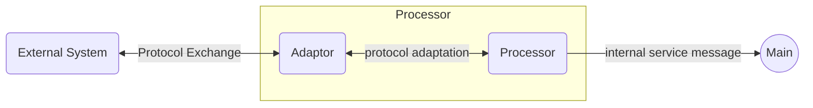
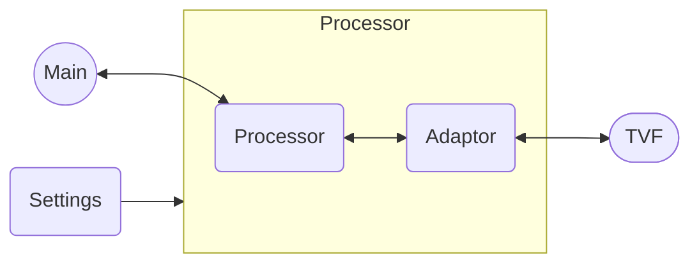

ProSA - **Pro**tocol **S**ervice **A**daptor
==============================

ProSA is a merge of multiple [Worldline](https://worldline.com/) internal product concepts caviarized to be released as a [Rust](https://www.rust-lang.org/) open-source.
The library aimed at providing a simple and lightweight protocol service adaptor for service oriented architectures.
The goal of this project is to provide a flexible and scalable platform for developing and deploying microservices, allowing developers to focus on writing business logic while ProSA takes care of the underlying infrastructure concers.

A [ProSA mdBook](https://worldline.github.io/prosa) is available if you want to learn everything about ProSA.

## Legend

ProSA components are illustrated:
 - Main: 
 - TVF: 
 - Processor: 
 - Settings: 
 - Adaptor: 

## Service approach

ProSA is made to empower SOA (*S*ervice *O*riented *A*rchitecture).
To do so, ProSA is built around a _service bus_ that can be local or distributed.

Around the service bus, there are gravitating processors that offer or consume services.

ProSA processors can be autonomous or built to connect external systems to make them accessible as a service.

## Getting Started

Everything you need to know about ProSA components is describe in the [Docs.rs](https://docs.rs/prosa/latest/prosa/) documentation.

## Deploying

ProSA is not a full product that you can run.
It's intended to be a framework to run processors that offer/consume services.

So ProSA needs to be built with a set of processors (internal or external) to work.
To build one, please refer to [cargo-prosa](./cargo-prosa/README.md).

## Processor list

### Worldline

- [Hyper](https://github.com/worldline/ProSA-Hyper): HTTP processor

### Third parties

- [Fetcher](https://github.com/reneca/ProSA-Fetcher): Fetch information from remote systems
- [Ollama](https://github.com/reneca/ProSA-Ollama): Ollama processor

## Authors

### Worldline

- [Jérémy HERGAULT](https://github.com/reneca)
- [Anthony THOMAS](https://github.com/Timmy80)
- [Olivier SCHYNS](https://github.com/oschijns)
- [René-Louis EYMARD](https://github.com/rleymard)

### Posterity

- [Julien TERUEL](https://github.com/JT117)
