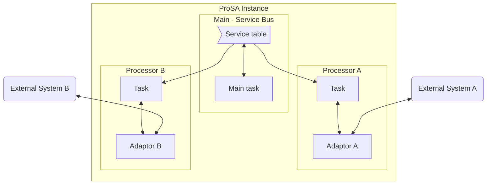
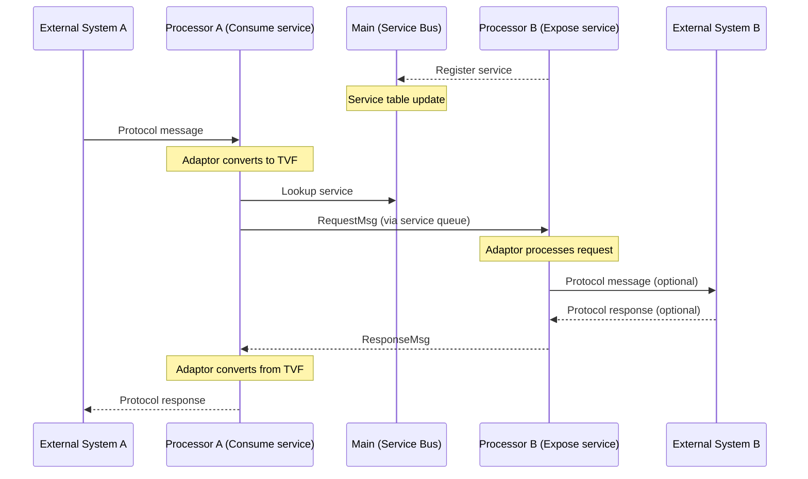

# Architecture

This chapter provides a high-level overview of the ProSA architecture, explaining how all the components interact to form a working microservice platform.

## Overview

ProSA follows a **service bus** pattern. At its core, a central **Main** processor routes messages between autonomous **Processors**, each of which communicates with external systems through an **Adaptor**. Messages flow through the system using an internal format called **TVF** (Tag-Value Field).

## Components

### Main (Service Bus)

The **Main** is the central hub of a ProSA instance. It is responsible for:

- **Message routing**: forwarding requests and responses between processors
- **Service table management**: maintaining a registry of which processors provide which services
- **Processor lifecycle**: tracking processor registration, removal, crashes, and restarts
- **Observability**: collecting system-wide metrics (RAM usage, service counts, processor states)
- **Shutdown coordination**: propagating shutdown signals to all processors

There is exactly **one Main** per ProSA instance. It runs on the Tokio async runtime and processes messages from its internal queue.

### Processors

A **Processor** is an autonomous unit that runs in its own thread(s). Processors:

- **Register** with the Main to join the service bus
- **Declare services** they can provide (e.g., `"PAYMENT"`, `"AUTH"`)
- **Send and receive messages** through the Main's routing system
- **Run independently**, each in their own Tokio runtime (configurable: single-thread, multi-thread, or shared with Main)

Processors communicate exclusively through the Main bus using **internal messages** (`InternalMsg`):

| Message Type | Purpose |
|-------------|---------|
| `Request` | Send a transaction to a service for processing |
| `Response` | Return the result of a processed request |
| `Error` | Return an error for a request (timeout, unreachable, protocol error) |
| `Service` | Update the processor's copy of the service table |
| `Shutdown` | Ask the processor to stop gracefully |

### Adaptors

An **Adaptor** is the bridge between a processor and the outside world. It handles:

- **Protocol translation**: converting external protocol messages (HTTP, TCP, custom binary, etc.) into internal TVF messages
- **Initialization**: setting up connections and resources when the processor starts
- **Termination**: cleaning up when the processor shuts down

Each processor handle their adaptor as they wish. The adaptor is defined as a trait, so different protocol implementations can be swapped in without changing the processor logic.

Adaptors can return values either synchronously or asynchronously using the [`MaybeAsync`](https://docs.rs/prosa/latest/prosa/core/adaptor/enum.MaybeAsync.html) enum.

### TVF (Tag-Value Field)

**TVF** is the internal message format. It is a trait, not a concrete type, which means different implementations can be used depending on performance or protocol requirements.

The TVF trait provides a key-value interface where fields are identified by numeric IDs and can hold various types: strings, integers, floats, bytes, dates, and nested TVF buffers.

`SimpleStringTvf` is the built-in reference implementation. See the [TVF chapter](ch02-01-tvf.md) for details.

### Service Table

The **Service Table** is maintained by Main and distributed to all processors. It maps service names (strings) to processor queues. When multiple processors provide the same service, requests are distributed using **round-robin** load balancing.

When the service table changes, Main notifies all processors with an updated copy.

## Message Flow

Here is the typical flow of a request through ProSA:

Note that processors send requests **directly** to the target processor's queue (looked up from the service table). They do not go through Main for every transaction — Main is only involved in service registration and table distribution.

## Processor Lifecycle

1. **Creation**: `ProcConfig::create()` — allocates the processor with its settings and Main bus reference
2. **Run**: `Proc::run()` — spawns the processor in its own thread/runtime
3. **Registration**: `proc.add_proc()` — notifies Main that the processor is active
4. **Service declaration**: `proc.add_service_proc(names)` — registers the services this processor provides
5. **Processing loop**: `internal_run()` — the main event loop, receiving and processing messages
6. **Shutdown**: on `InternalMsg::Shutdown`, the processor calls `adaptor.terminate()` and `proc.remove_proc()`

### Error Recovery

If a processor's `internal_run()` returns an error:
- **Recoverable errors**: the processor restarts after a delay (exponential backoff up to a configured maximum)
- **Fatal errors**: the processor is marked as crashed and does not restart
- If ProSA is shutting down, no restart is attempted
