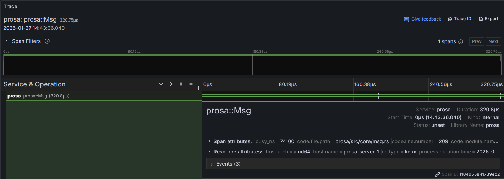

# Monitoring

If you configured [Observability](ch01-02-01-observability.md), ProSA offers observability data out of the box.

## Metrics

Metrics are useful in processors.
To know more, refer to the processor you use to know which metrics they expose.
They should export [metrics](ch02-04-observability.md#metrics).

But ProSA has also its own metrics to have a global view of what's running.
This generic dashboard will be available soon from Grafana if you want to import it.

### Graphical representation

Having a view of every processor and service is important to know if your processors are healthy and if your services are up and running.
There is a node graph to view the entire state of ProSA:

From this graph, you'll see:
- Processors 🔄
  - green indicates that they are running
  - orange if they experienced at least one restart
  - grey if they are stopped
  - red if they crashed
- Services ⠶
  - green if at least one processor exposes it
  - grey if they are not available
- Links between processors and services representing processors that expose a service

From that graph, you have a complete view of your ProSA state.

### System metrics

ProSA provides RAM metrics in order to keep track of process allocation.
This could be useful to know if on a VM ProSA is using the RAM, or it's another process on the host.

It provides 2 `type` of metrics:
- `virtual` for virtual RAM used
- `physical` for physical RAM used

> To have system metrics, you need to enable the feature `system-metrics` for ProSA.

## Traces

Since ProSA is a transactional framework, traces are a must-have to view transaction-relative information.

From this global trace, you can have [processor spans](ch02-04-observability.md#traces) attached to it.

## Logs

All logs generated by ProSA are available.
Normally processors should use the ProSA [logging](ch02-04-observability.md#logs) system.
If they do not, please refer to your processor to know how to handle them.
